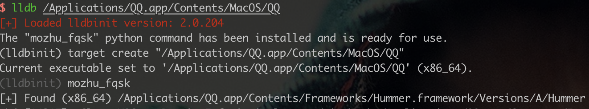
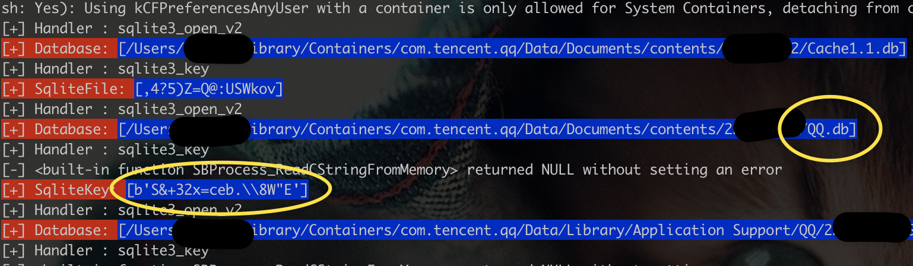
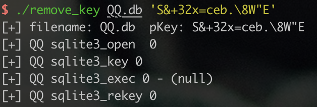
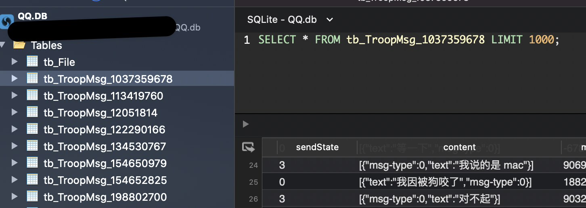

# [调试逆向] 撬开MacQQ的本地聊天记录SQLite数据库

## Usage

- 抓取数据库加密密钥
  - 运行 `make lldbinit` 添加插件 `mozhu_cmd.py` 到 `~/.lldbinit`
  - 运行 `lldb /Applications/QQ.app/Contents/MacOS/QQ`
  - 执行 lldb 插件命令 `mozhu_fqsk` 即可
- 重置密码
  - `make` 生成 `remove_key`
  - 复制抓取到的 QQ.db 文件到当前目录
  - 执行 `./remove_key QQ.db key`

## Reference

> [[调试逆向] 撬开MacQQ的本地SQLite数据库（适用于Msg3.0.db+）](https://www.52pojie.cn/thread-1335657-1-1.html)